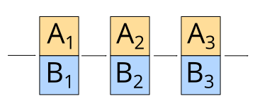

# Data types

---

## Primitive data types

---

### Integers

```rust
let a = 42;       // 32-bit signed int
let b = 0xDEAD;   // hexadecimal
let c = 0o4242;   // octal
let d = 0b101010; // binary
let e = 2_147_483_647; // _ for readability
```

per default: 32-bit signed integer (via [RFC 212](https://github.com/rust-lang/rfcs/blob/master/text/0212-restore-int-fallback.md))

---

### Integer type suffixes

```rust
let f = 0i64;   // 0 as signed 64-bit int
let g = 0u8;    // 0 as unsigned 8-bit int
let h = 0u16;   // 0 as unsigned 16-bit int
let i = 0u32;   // 0 as unsigned 32-bit int
let j = 0u64;   // 0 as unsigned 64-bit int
let k = 0u128;  // 0 as unsigned 128-bit int
```

**Question:** Give me [usecases](https://en.wikipedia.org/wiki/128-bit#Uses) for 128-bit integers.

Explicit type declarations:

```rust
let l: u128 = 0;
```

---

### Overflow

```rust
fn main() {
    let f = 255u8;
    println!("{}", f + 1);
}
```

---

### Overflow

<pre>
user@sys ~ % <strong>./test</strong>
thread 'main' panicked at 'attempt to add with overflow', test2.rs:3:20
note: Run with `RUST_BACKTRACE=1` environment variable to display a backtrace.
101 user@sys ~ % <strong>RUST_BACKTRACE=1 ./test</strong>
thread 'main' panicked at 'attempt to add with overflow', test2.rs:3:20
stack backtrace:
   0: std::sys::unix::backtrace::tracing::imp::unwind_backtrace
             at src/libstd/sys/unix/backtrace/tracing/gcc_s.rs:39
   1: std::sys_common::backtrace::_print
             at src/libstd/sys_common/backtrace.rs:71
…  9: test2::main
  10: std::rt::lang_start::{{closure}}
  11: std::panicking::try::do_call
… 15: main
  16: __libc_start_main
  17: _start</span>
101 user@sys ~ %
</pre>

---

### What happens if an integer overflows in C?

---

### What happens if an integer overflows in C?

Undefined behavior for signed integers. <br/> Modulo power of two for unsigned integers in C11.

Undefined behavior (in the sense of C) in rust should be restricted to `unsafe` (see [the Rust book](https://doc.rust-lang.org/reference/behavior-considered-undefined.html) and [reddit](https://www.reddit.com/r/rust/comments/1gys8y/does_rust_have_undefined_behaviour/caqh4bw/)). But there is no formal model.

---

### Fun fact about integer overflows

> In 2014, the music video for PSY's Gangnam Style received so many views on YouTube that it breached the maximum possible viewership number within a signed 32-bit integer. YouTube subsequently amended the maximum count to a 64-bit integer. 

---

### Two's complement


---

### division by zero

```rust
fn main() {
    println!("{}", 1/0);
}
```

---

<pre>
<span style="font-weight:bold;"></span><span style="font-weight:bold;filter: contrast(70%) brightness(190%);color:red;">error</span><span style="font-weight:bold;">: attempt to divide by zero</span>
 <span style="font-weight:bold;"></span><span style="font-weight:bold;filter: contrast(70%) brightness(190%);color:blue;">--&gt; </span>test2.rs:2:20
  <span style="font-weight:bold;"></span><span style="font-weight:bold;filter: contrast(70%) brightness(190%);color:blue;">|</span>
<span style="font-weight:bold;"></span><span style="font-weight:bold;filter: contrast(70%) brightness(190%);color:blue;">2</span> <span style="font-weight:bold;"></span><span style="font-weight:bold;filter: contrast(70%) brightness(190%);color:blue;">| </span>    println!(&quot;{}&quot;, 1/0);
  <span style="font-weight:bold;"></span><span style="font-weight:bold;filter: contrast(70%) brightness(190%);color:blue;">| </span>                   <span style="font-weight:bold;"></span><span style="font-weight:bold;filter: contrast(70%) brightness(190%);color:red;">^^^</span>
  <span style="font-weight:bold;"></span><span style="font-weight:bold;filter: contrast(70%) brightness(190%);color:blue;">|</span>
  <span style="font-weight:bold;"></span><span style="font-weight:bold;filter: contrast(70%) brightness(190%);color:blue;">= </span><span style="font-weight:bold;">note</span>: #[deny(const_err)] on by default

<span style="font-weight:bold;"></span><span style="font-weight:bold;filter: contrast(70%) brightness(190%);color:red;">error</span><span style="font-weight:bold;">: reaching this expression at runtime will panic or abort</span>
 <span style="font-weight:bold;"></span><span style="font-weight:bold;filter: contrast(70%) brightness(190%);color:blue;">--&gt; </span>test2.rs:2:20
  <span style="font-weight:bold;"></span><span style="font-weight:bold;filter: contrast(70%) brightness(190%);color:blue;">|</span>
<span style="font-weight:bold;"></span><span style="font-weight:bold;filter: contrast(70%) brightness(190%);color:blue;">2</span> <span style="font-weight:bold;"></span><span style="font-weight:bold;filter: contrast(70%) brightness(190%);color:blue;">| </span>    println!(&quot;{}&quot;, 1/0);
  <span style="font-weight:bold;"></span><span style="font-weight:bold;filter: contrast(70%) brightness(190%);color:blue;">| </span>                   <span style="font-weight:bold;"></span><span style="font-weight:bold;filter: contrast(70%) brightness(190%);color:red;">^^^</span> <span style="font-weight:bold;"></span><span style="font-weight:bold;filter: contrast(70%) brightness(190%);color:red;">attempt to divide by zero</span>

<span style="font-weight:bold;"></span><span style="font-weight:bold;filter: contrast(70%) brightness(190%);color:red;">error</span><span style="font-weight:bold;">: aborting due to 2 previous errors</span>
</pre>

---

### Casting / primitive type coersion

```
fn main() {
    let n = 255u8;
    println!("{}", n as u16 + 1);
}
```

* `as` keyword for casting
* necessary to prevent overflows and underflows

---

### Floating point numbers

The [IEEE 754](https://en.wikipedia.org/wiki/IEEE_754) “IEEE Standard for Floating-Point Arithmetic” standard defines:

* **arithmetic formats:** sets of binary and decimal floating-point data, which consist of finite numbers (including signed zeros and subnormal numbers), infinities, and special "not a number" values (NaNs)
* **interchange formats:** encodings that may be used to exchange floating-point data in an efficient and compact form

---

### Floating point numbers

* **rounding rules:** properties to be satisfied when rounding numbers during arithmetic and conversions
* **operations:** arithmetic and other operations (such as trigonometric functions) on arithmetic formats
* **exception handling:** indications of exceptional conditions (such as division by zero, overflow, etc.)

[1985](https://en.wikipedia.org/wiki/IEEE_754-1985) first publication, [2008](https://en.wikipedia.org/wiki/IEEE_754-2008_revision) revised/extended, IEEE 754-2019 this month (minor fixes)

---

### Floating point numbers

```rust
fn main() {
    let f = 3141.5962f32;
    println!("{}", f);         // 3141.5962
    println!("{:.2}", f);      // 3141.60
    println!("{1:.0$}", 2, f); // 3141.60
    println!("{:e}", f);       // 3.1415962e3
    println!("{}", f as u32);  // 3141
}
```

---

### Floating point numbers


(1, 8, 23) for 32-bit floats. <br/>
(1, 11, 52) for 64-bit floats (“double”).

---

### Floating point numbers

<table>
<tr><th>sign</th><td>=</td><td>0</td><td>non-negative</td></tr>
<tr><th>exponent</th><td>=</td><td>-3</td><td>3 dec. positions dot offset RTL</td></tr>
<tr><th>fraction</th><td>=</td><td>31415962</td><td></td></tr>
</table>

<div style="text-align:center"><span style="font-size:200%">1 ・ 3.1415962 ・ 10<sup>-3</sup></span></div>

But in **binary**! `3141.5962 = 0 10001010 10001000101100110001010` in binary.

<!--
fn main() {
    println!("{:032b}", (3141.5962f32).to_bits());
}
-->

---

### Floating point number: inaccuracy

`1./5` cannot be represented in binary accurately. Approximations are used.

```rust
fn main() {
    let base = 1. / 5f32;
    for i in 1..=14u32 {
        let current_float = base * 5f32.powi(i as i32);
        let current_int = 5u32.pow(i - 1);
        println!("{}", current_float as i32 - current_int as i32);
    }
}
```

`0` (11 times), then `-1`, then `-1`, then `-21`

---

### Floating point number: inaccuracy

```rust
use std::f32::consts::PI;

fn main() {
    println!("{}", (PI / 2.).tan());
    // -22877334
}
```


---

### Floating point number: special values

Two different zeros are specified.

```rust
fn main() {
    println!("{:032b}", 0f32.to_bits());
    // 00000000000000000000000000000000
    println!("{:032b}", (-0f32).to_bits());
    // 10000000000000000000000000000000
    println!("{}", -0f32 == 0f32);
    // true
}
```

---

### Floating point number: special values

```rust
use std::f32;
fn main() {
    println!("{}", f32::NAN);           // NaN
    println!("{}", f32::INFINITY);      // inf
    println!("{}", f32::NEG_INFINITY);  // -inf
    let neg_inf = f32::NEG_INFINITY;
    println!("{}",
        f32::INFINITY == -neg_inf &&
        f32::INFINITY == neg_inf * neg_inf &&
        f32::INFINITY != f32::NAN &&
        !(f32::NEG_INFINITY < f32::NAN) &&
        f32::NAN != f32::NAN &&
        f32::NEG_INFINITY < 0f32
    );  // true
}
```

---

### Floating point number: special values

```rust
use std::f32;

fn main() {
    println!("{}", 0. * f32::INFINITY); // NaN
    println!("{}", f32::INFINITY - 1.); // inf
    println!("{}", f32::INFINITY - f32::INFINITY); // NaN
    println!("{}", 2. % 0.); // NaN
}
```

Comparison with NaN is always false except for `!=` (always true).
A total ordering is defined assuming `-0 == 0` are one value.

---

### Floating point number: special values

IEEE 754 specifies two Not-A-Number (NAN) values.
Signalling NaNs are inaccessible (like in most other languages).

```rust
fn main() {
    println!("{}", 0f32/0f32);
}
```

--- 

### Floating point number: special values

* [Signalling NaNs](https://en.wikipedia.org/wiki/NaN#Signaling_NaN) are used for debugging
* Quiet NaNs indicate arithmetic errors

```rust
use std::f32;

fn main() {
    let nan = f32::NAN;
    println!("{}", nan + nan * nan / 3.);
    // quiet until the return value is displayed
}
```

---

### Floating point number: something I cannot explain

```rust
use std::f32;

fn main() {
    println!("{}", f32::NAN as u32);
}
```

---

### Floating point number: something I cannot explain

```rust
use std::f32;

fn main() {
    println!("{}", f32::NAN as u32); // 0
}
```

<!-- TODO: what does the standard say? -->

---

## Documentation

For more, see the documentation:

* [doc.rust-lang.org/std/primitive.f32](https://doc.rust-lang.org/std/primitive.f32.html)
* [doc.rust-lang.org/std/primitive.f64](https://doc.rust-lang.org/std/primitive.f64.html)

---

## Other primitive types

* char: `'x'`, `'λ'`
* str: `"Hello World"`, `r"raw string"`
* bool: `true`, `false`
* isize, usize: `1usize`, `42isize`

primitive collection types:

* arrays
* slices
* tuples

To be discussed in the following talks.

<!-- TODO rationals, etc -->

---

# Iterator

`std::iter::Iterator trait` sounds super technical, but I want to talk about the opposite:
the *concept* of `std::iter::Iterator trait`.

For now: traits are interfaces implemented by types/data structures.
Details will follow soon.

---

## Iterator

Iterators are fundamental. Whenever we have a collection of values,
we want to iterate them. And here we want to discuss *some* methods
implemented by *every* iterator. Methods common for functional languages.

See [doc.rust-lang.org/std/iter/trait.Iterator.html](https://doc.rust-lang.org/std/iter/trait.Iterator.html)

---

## `cycle`

Given one iterator, we cycle through the elements.


---

## `chain`

Given two iterators, we iterate through the elements of the first iterator.
Then we iterate through the elements of the second iterator.


---

## `zip`

Given `n` iterators, we iterate over the smallest number of elements.
The iterated elements are `n`-tuples.



---

## `map`

Given one iterator and a function, we apply a function to each element.


---

## `filter`

Given an iterator and a function,
we only return elements for which the function returns true.


---

## `skip`

Given an iterator and a number `n`, we skip the first `n` elements.


---

## `take`

Given an iterator and a number `n`, we only return the first `n` elements.


---

## `fold`

Given an iterator and an initial value, we take the first element and the initial value and supply it to the function.
This intermediate value with the next value is supplied to the function. This continues. The last intermediate value becomes the final value.

---

Also called `reduce` or `inject`.


---

# Total ordering

<div style="text-align:center">
`eq`, `ne`, `lt`, `le`, `gt`, `ge`
</div>

* The operations ≤ and ≥ define a partial ordering (reflexivity, antisymmetry, transitivity).
* Here we even have a total ordering (additionally connexity).

---

### std::Iter::Iterator

```rust
let a = [1, 2, 3];
let mut iter = a.iter();

assert_eq!(Some(&1), iter.next());
assert_eq!(Some(&2), iter.next());
assert_eq!(Some(&3), iter.next());
```

---

# Finish line

---

## Quiz

<dl>
<dt>When shouldn't you use floating point numbers?</dt>
  <dd>&nbsp;</dd>
<dt>What is the default integer type? <code>let a = 42;</code></dt>
  <dd>&nbsp;</dd>
<dt>Give an example of a rational number that cannot be represented accurately in IEEE 754</dt>
  <dd>&nbsp;</dd>
<dt>What does the <code>take</code> function do?</dt>
  <dd>&nbsp;</dd>
</dl>

---

## Quiz

<dl>
<dt>When shouldn't you use floating point numbers?</dt>
  <dd>For monetary data.</dd>
<dt>What is the default integer type? <code>let a = 42;</code></dt>
  <dd><a href="https://github.com/rust-lang/rfcs/blob/master/text/0212-restore-int-fallback.md">i32</a></dd>
<dt>Give an example of a rational number that cannot be represented accurately in IEEE 754</dt>
  <dd>1 / 5</dd>
<dt>What does the <code>take</code> function do?</dt>
  <dd>Iterator that returns the first <code>n</code> elements</dd>
</dl>

---

## Next time

<dl>
  <dt>Suggested topic</dt>
   <dd><em>Control structures and functions</em></dd>
  <dt>Topics to be done</dt>
   <dd>traits, crates, borrowing, memory management, lifetimes, collections, strings, Unicode, regex, CSV/JSON/XML/YAML, i18n, logging, multithreading, data structures, documentation, cross compilation, concurrency, web assembly, …</dd>
</dl>
